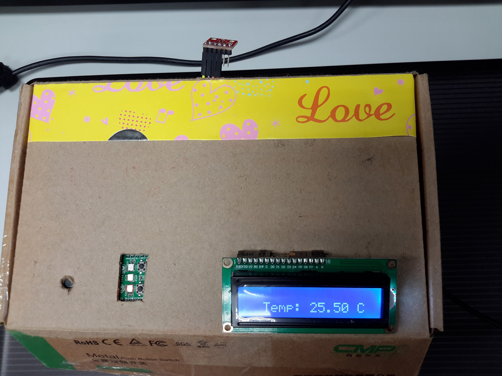
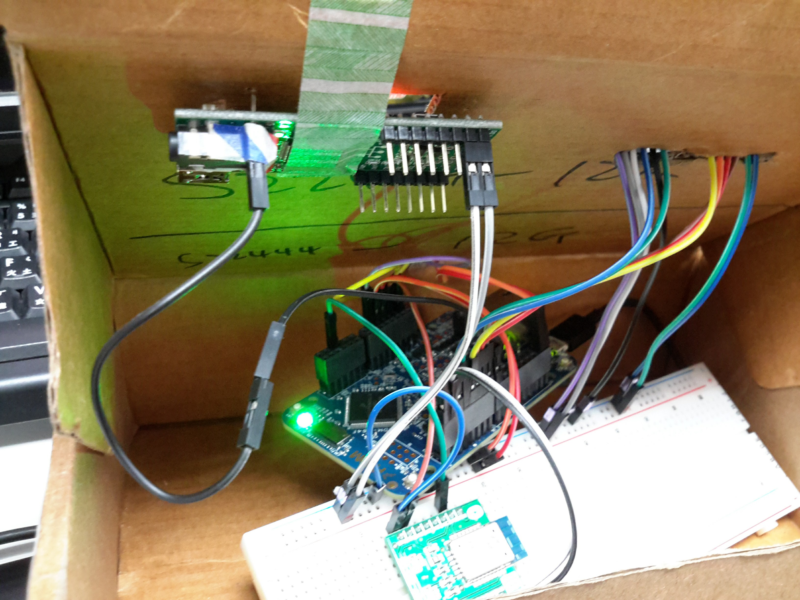

## Embedded Midterm Project, with mbed K64F

### * Topic
Temperature Notifier  

### * Function
1. 每秒更新TMP sensor 的值在LCD上
2. SpeakUp Click 隨時偵測使用者的指令
3. K64F 和 PC 以BLE連接，當SpeakUp Click 偵測到指令時傳送當前溫度到PC
4. 當BLE傳輸時板子的綠燈亮

### * Hardware Component
1. mbed K64F
2. TMP102 Temperature Sensor (I2C)
3. LCD1602 (HD44780)
4. BLE2 click (UART)
5. SpeakUp click (GPIO)

### * Picture of Final Work
  
We can see LCD, part of SpeakUp, and Temperature Sensor outside the box.  

  
K64F, BLE2 click, and numerous wires hide in the box.  

### * Implementation
1. Update temperature by Ticker
2. Vocal command serve as an InterruptIn

### * Problem Countered
1. SpeakUp Click command detection
    SpeakUp 無法正確辨識出指令，利用手機錄指令後，每次要傳遞指令時播放錄音。
